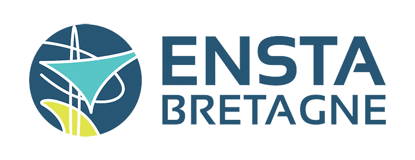

<p align="center">
  
</p>

## Introduction

This repository implements some deep-learning models for ship detection on SAR images. 
All models are developed to work with the [Ship SAR Detection Dataset (SSDD)](https://github.com/TianwenZhang0825/Official-SSDD).

Moreover, the following work is based on the [OpenMMLab Detection Toolbox and Benchmark](https://github.com/open-mmlab/mmdetection).

## Installation

**Step 1:** create and activate conda environment with python 3.8
```
conda create -n myenv python=3.8
conda activate myenv
```
**Step 2:** install [MMCV](https://github.com/open-mmlab/mmcv) using [MIM](https://github.com/open-mmlab/mim). 
```
pip install -U openmim
mim install mmcv-full
```
**Step 3:** install project from source 
```
git clone https://github.com/ALLARDLE/ShipSARDetect_mmdetection.git
cd ShipSARDetect_mmdetection
pip install -v -e .
```
**Step 4:** download Ship SAR Detection Dataset in `data/` folder

<p align="center">
  
</p>

## Getting Started

Base configuration of SSDD is stored in `config/_base_/datasets/ssdd_detection.py`
All implemented model for SSDD are stored in `config/ssdd/` folder.

### Train models

**Faster R-CNN:**
- Run Faster R-CNN VGG16: ```python tools\train.py configs\ssdd\faster_rcnn_vgg16_fpn_ssdd.py``` 
- Run Faster R-CNN ResNet50: ```python tools\train.py configs\ssdd\faster_rcnn_r50_fpn_ssdd.py```
- Run Faster R-CNN ResNet50 pretrained: ```python tools\train.py configs\ssdd\faster_rcnn_r50_fpn_ssdd_pretrained.py```

**Cascade R-CNN:**
- Run Cascade R-CNN VGG16: ```python tools\train.py configs\ssdd\cascade_rcnn_vgg16_fpn_ssdd.py```
- Run Cascade R-CNN ResNet50: ```python tools\train.py configs\ssdd\cascade_rcnn_r50_fpn_ssdd.py```
- Run Cascade R-CNN Swin: ```python tools\train.py configs\ssdd\cascade_rcnn_swin_fpn_ssdd.py```
- Run Cascade R-CNN Swin pretrained: ```python tools\train.py configs\ssdd\cascade_rcnn_swin_fpn_ssdd_pretrained.py```

### Test models
```
python tools\test.py configs\ssdd\faster_rcnn_r50_fpn_ssdd.py work_dirs\faster_rcnn_r50_fpn_ssdd\latest.pth --show-dir results
```

## In development 

In order to implement ESTDNet model from 
[Ship Detection in SAR Images Based on Feature Enhancement Swin Transformer and Adjacent Feature Fusion](https://www.mdpi.com/1709336)
article some changes in mmdet library.

**Backbone:** added Feature Enhancement Swin module as `feswin.py` and `feswinv2.py`.
v2 is based on Swin module of MMDetection whereas the v1 is based on PyTorch one.

**Neck:** added Adjacent Feature Fusion module as `aff.py`


## License

This project is released under the [Apache 2.0 license](LICENSE).


## README of Murphy

结果：没跑起来😭

mmdetection的环境好难配置啊，代码作者也没有给一个详细的环境和包的版本信息，跑代码的时候遇到了好多好多环境上的问题，有点崩溃😥

``` bash
(ShipSARDetection) houjinliang@3080server:~/MyCVProject/bDetection/ShipSARDetect_mmdetection$ pip list
Package                Version      Editable project location
---------------------- ------------ -----------------------------------------------------------------------------
addict                 2.4.0
aliyun-python-sdk-core 2.14.0
aliyun-python-sdk-kms  2.16.2
appdirs                1.4.4
asynctest              0.13.0
attributee             0.1.9
attrs                  23.2.0
Brotli                 1.0.9
cachetools             5.3.2
certifi                2023.11.17
cffi                   1.16.0
charset-normalizer     2.0.4
cityscapesScripts      2.2.3
click                  8.1.7
codecov                2.1.13
colorama               0.4.6
coloredlogs            15.0.1
contourpy              1.1.1
coverage               7.5.3
crcmod                 1.7
cryptography           41.0.7
cycler                 0.12.1
Cython                 3.0.10
dotty-dict             1.3.1
einops                 0.7.0
exceptiongroup         1.2.1
flake8                 7.0.0
flatbuffers            24.3.25
fonttools              4.47.0
humanfriendly          10.0
idna                   3.4
imagecorruptions       1.1.2
imageio                2.34.1
importlib-metadata     7.0.1
importlib-resources    6.1.1
iniconfig              2.0.0
interrogate            1.7.0
isort                  4.3.21
jmespath               0.10.0
joblib                 1.3.2
kiwisolver             1.4.5
kwarray                0.6.18
lap                    0.4.0
Markdown               3.5.1
markdown-it-py         3.0.0
mat4py                 0.6.0
matplotlib             3.7.4
mccabe                 0.7.0
mdurl                  0.1.2
mkl-fft                1.3.8
mkl-random             1.2.4
mkl-service            2.4.0
mmcls                  0.25.0
mmcv-full              1.4.7
mmdet                  2.28.1       /mnt/houjinliang/MyCVProject/bDetection/ShipSARDetect_mmdetection
mmengine               0.10.2
mmpretrain             1.2.0
mmtrack                0.14.0       /mnt/houjinliang/MyCVProject/bDetection/ShipSARDetect_mmdetection/src/mmtrack
model-index            0.1.11
modelindex             0.0.2
motmetrics             1.4.0
mpmath                 1.3.0
networkx               3.1
numpy                  1.22.4
nvidia-ml-py           12.535.133
nvitop                 1.3.2
onnx                   1.7.0
onnxruntime            1.18.0
opencv-python          4.9.0.80
opendatalab            0.0.10
openmim                0.3.9
openxlab               0.0.32
ordered-set            4.1.0
oss2                   2.17.0
packaging              23.2
pandas                 1.3.5
Pillow                 10.0.1
pip                    23.3.1
platformdirs           4.1.0
pluggy                 1.5.0
protobuf               3.20.1
psutil                 5.9.7
py                     1.11.0
pycocotools            2.0.7
pycodestyle            2.11.1
pycparser              2.21
pycryptodome           3.19.1
pyflakes               3.2.0
Pygments               2.17.2
pyOpenSSL              23.2.0
pyparsing              3.1.1
pyquaternion           0.9.9
PySocks                1.7.1
pytest                 8.2.2
python-dateutil        2.8.2
pytz                   2023.3.post1
PyWavelets             1.4.1
PyYAML                 6.0.1
requests               2.28.2
rich                   13.4.2
scikit-image           0.19.3
scikit-learn           1.3.2
scipy                  1.7.3
seaborn                0.13.1
setuptools             60.2.0
shapely                2.0.2
six                    1.16.0
sympy                  1.12.1
tabulate               0.9.0
termcolor              2.4.0
terminaltables         3.1.10
threadpoolctl          3.2.0
tifffile               2023.7.10
tomli                  2.0.1
torch                  1.11.0
torchaudio             0.11.0
torchvision            0.12.0
tqdm                   4.65.2
trackeval              1.0.dev1
typing                 3.7.4.3
typing_extensions      4.7.1
tzdata                 2023.4
ubelt                  1.3.6
urllib3                1.26.18
wheel                  0.41.2
xdoctest               1.1.5
xmltodict              0.13.0
yapf                   0.40.2
zipp                   3.17.0

(ShipSARDetection) houjinliang@3080server:~/MyCVProject/bDetection/ShipSARDetect_mmdetection$ python --version
Python 3.8.18

(ShipSARDetection) houjinliang@3080server:~/MyCVProject/bDetection/ShipSARDetect_mmdetection$ nvcc --version
nvcc: NVIDIA (R) Cuda compiler driver
Copyright (c) 2005-2021 NVIDIA Corporation
Built on Mon_May__3_19:15:13_PDT_2021
Cuda compilation tools, release 11.3, V11.3.109
Build cuda_11.3.r11.3/compiler.29920130_0
```