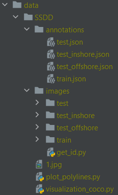

## Introduction

This repo implement different models for ship detection on SAR images. 
All models are developed to work with the [Ship SAR Detection Dataset (SSDD)](https://github.com/TianwenZhang0825/Official-SSDD).

Moreover, the following work is based on the [OpenMMLab Detection Toolbox and Benchmark](https://github.com/open-mmlab/mmdetection).

## Installation

**Step 1:** create and activate conda environment with python 3.8
```
conda create -n myenv python=3.8
conda activate myenv
```
**Step 2:** install [MMCV](https://github.com/open-mmlab/mmcv) using [MIM](https://github.com/open-mmlab/mim). 
```
pip install -U openmim
mim install mmcv-full
```
**Step 3:** install project from source 
```
git clone https://github.com/ALLARDLE/ShipSARDetect_mmdetection.git
cd ShipSARDetect_mmdetection
pip install -v -e .
```
**Step 4:** download Ship SAR Detection Dataset in `data/` folder

<p align="center">
  
</p>

## Getting Started

Base configuration of SSDD is stored in `config/_base_/datasets/ssdd_detection.py`
All implemented model for SSDD are stored in `config/ssdd/` folder.

### Train models

**Faster R-CNN:**
- Run Faster R-CNN VGG16: ```python tools\train.py configs\ssdd\faster_rcnn_vgg16_fpn_ssdd.py``` 
- Run Faster R-CNN ResNet50: ```python tools\train.py configs\ssdd\faster_rcnn_r50_fpn_ssdd.py```
- Run Faster R-CNN ResNet50 pretrained: ```python tools\train.py configs\ssdd\faster_rcnn_r50_fpn_ssdd_pretrained.py```

**Cascade R-CNN:**
- Run Cascade R-CNN VGG16: ```python tools\train.py configs\ssdd\cascade_rcnn_vgg16_fpn_ssdd.py```
- Run Cascade R-CNN ResNet50: ```python tools\train.py configs\ssdd\cascade_rcnn_r50_fpn_ssdd.py```
- Run Cascade R-CNN Swin: ```python tools\train.py configs\ssdd\cascade_rcnn_swin_fpn_ssdd.py```
- Run Cascade R-CNN Swin pretrained: ```python tools\train.py configs\ssdd\cascade_rcnn_swin_fpn_ssdd_pretrained.py```

### Test models
```
python tools\test.py configs\ssdd\faster_rcnn_r50_fpn_ssdd.py work_dirs\faster_rcnn_r50_fpn_ssdd\latest.pth --show-dir results
```

## In development 

In order to implement ESTDNet model from 
[Ship Detection in SAR Images Based on Feature Enhancement Swin Transformer and Adjacent Feature Fusion](https://www.mdpi.com/1709336)
article some changes in mmdet library.

**Backbone:** added Feature Enhancement Swin module as `feswin.py` and `feswinv2.py`.
v2 is based on Swin module of MMDetection whereas the v1 is based on PyTorch one.

**Neck:** added Adjacent Feature Fusion module as `aff.py`


## License

This project is released under the [Apache 2.0 license](LICENSE).
